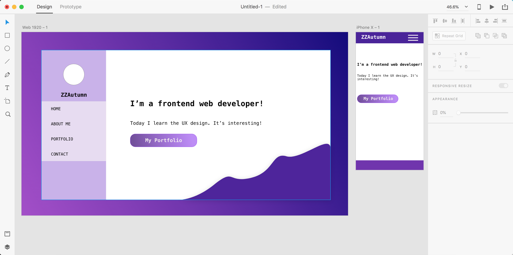
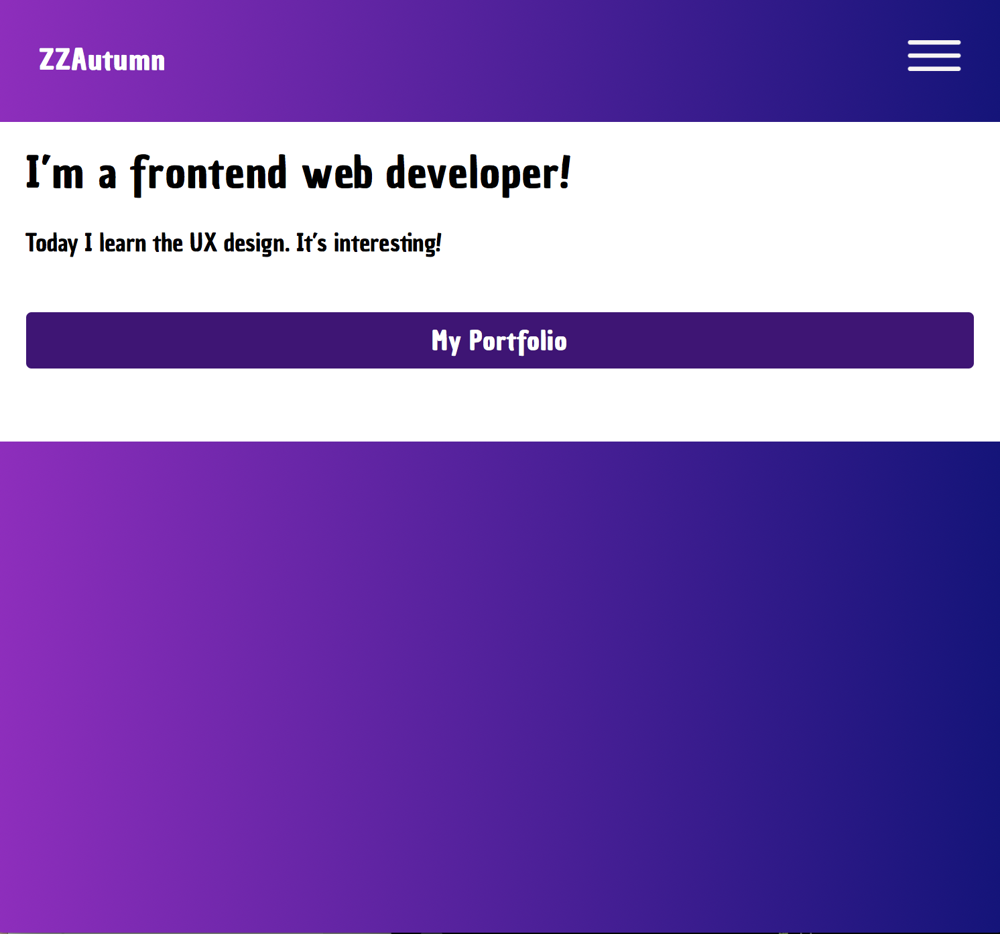
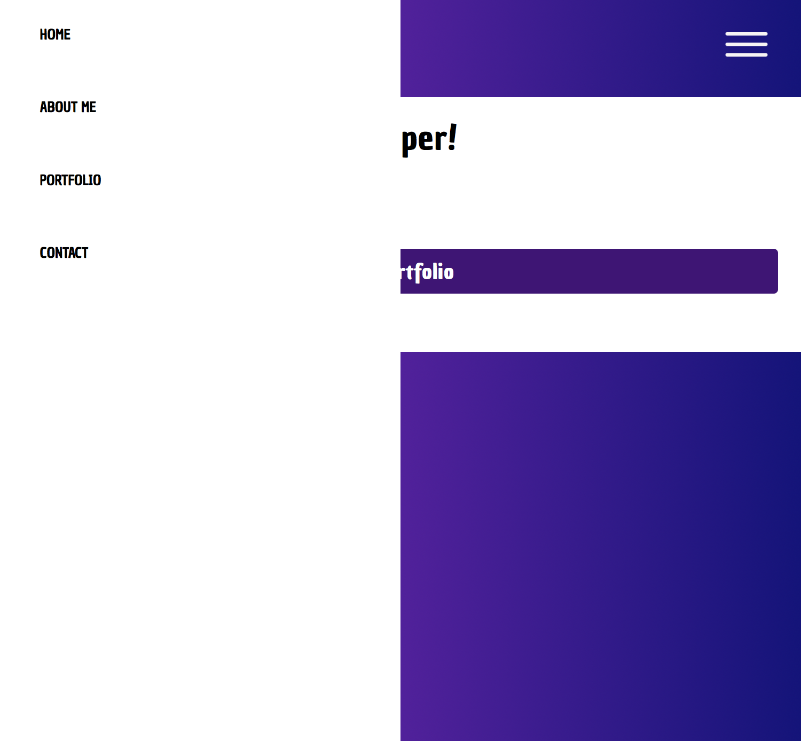

<h5>
  体验用 <a href='https://www.adobe.com/cn/products/xd.html'>Adobe Experience Design</a>设计网页，然后用html css实现。
</h5>

  使用media querry，在不同设备上呈现不一样的样式(这里的断点设置为768px，是一般的区分移动设备和桌面应用的尺寸)

  背景中使用的渐变色，可以用自动生成工具.<a href='https://cssgradient.io/'>https://cssgradient.io/</a>

  字体在google fonts中下载，并在css文件中引入，这样别人也能看到跟你一样的字体展示了。

<h4>效果展示:</h4>

  

  

  

